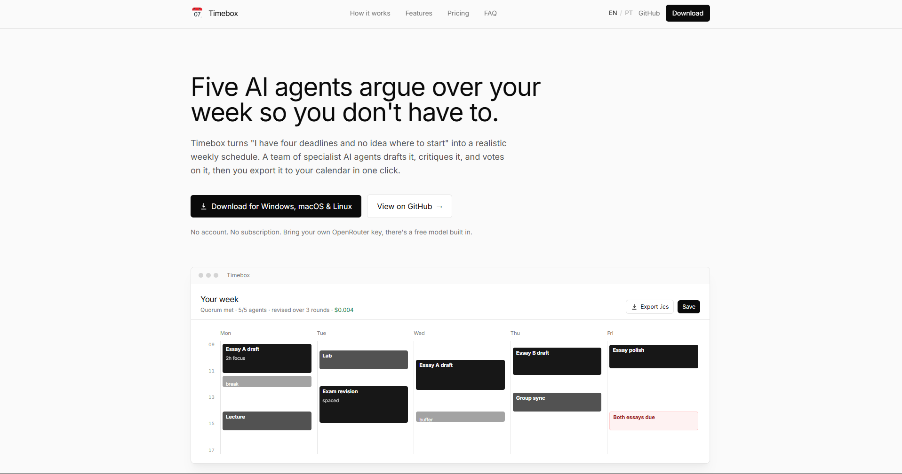

<div align="center">


# Timebox

*Five AI agents argue over your week so you don't have to.*


**[Landing page](landing/index.html)** · **[Download](https://github.com/zF4ke/timebox/releases)** · **[Architecture](docs/architecture.md)**

</div>

---

Timebox is a free, open source desktop app that turns a plain-language description of your week into a realistic weekly study schedule. A team of specialist AI agents drafts the plan, critiques it from five different angles, votes on it under a quorum you control, and then you export it straight to your calendar.

It is an Electron + React + TypeScript app. It is **bring-your-own-key**: you supply an [OpenRouter](https://openrouter.ai) API key, so you pay the model provider directly and never us. A free default model is included, so you can try it at zero cost.

> Timebox started life as an AASMA (Autonomous Agents and Multi-Agent Systems) university project. It still ships the benchmark harness it was evaluated with, documented in the developer section below.

## 📸 Preview

<div align="center">

A polished product overview lives in [`landing/index.html`](landing/index.html) (open it in a browser).

<!-- Add a planner + analytics screenshot at docs/preview.png and uncomment: -->
<!--  -->

</div>

---

## For users

### What it does

You describe your week in plain language: your tasks, deadlines, when you are free, and how you are feeling. An Interpreter agent extracts the structure. Five specialist agents (Deadline, Grade, Effort, Wellbeing, Risk) each critique the draft from their own angle. A Planner-Arbiter revises the calendar until the agents reach quorum or hit your iteration limit. You get a week grid you can inspect block by block, plus a one-click export to Google or Apple Calendar. Everything runs on your own machine.

### Quickstart

1. **Install dependencies:** `npm install`
2. **Get an OpenRouter API key** (see below).
3. **Run the app:** `npm run dev`
4. **Paste your key** into the app under **Settings**.
5. **Describe your week** in the composer and let the agents plan it.

### Get an OpenRouter key

1. Go to https://openrouter.ai/keys and sign in.
2. Create a new key and copy it.
3. In Timebox, open **Settings** and paste the key into the OpenRouter API key field.

The key is stored only in your OS user-data directory, never in the project folder and never sent anywhere except your own model calls to OpenRouter. The default model is `nvidia/nemotron-3-super-120b-a12b:free`, which is free, so you can plan at no cost while you try it.

### Planning flow

- **Composer** lets you type tasks and constraints in natural language. No rigid forms.
- **Live progress** shows the planning steps newest-first as the agents negotiate. You can cancel a run mid-flight.
- **Calendar view** is a FullCalendar week grid with color-coded blocks. Click any block to see its description, reasoning, and timing.
- **Saved plans** auto-save to your machine; load or delete them from the sidebar.
- **Import** by drag-and-dropping a JSON or ICS file anywhere on the app, or use the Import button.

### Export to your calendar

- **ICS export** produces a standard `.ics` file that imports cleanly into Google Calendar, Apple Calendar, or Outlook.
- **JSON export** is the full audit trail (every agent view, critique, and revision) if you want to inspect the reasoning.

### Install a packaged build

If you do not want to run from source, download a build for your OS from GitHub Releases. On Windows this is a portable `.exe`, on macOS a `.dmg`, on Linux an `AppImage`. Run it, open **Settings**, and paste your OpenRouter key.

### Settings reference

- **Model** picker with per-token pricing shown inline.
- **Quorum** (1 to 5): how many of the five agents must approve a plan.
- **Max iterations** (1 to 5): how many revision rounds before the plan settles.
- **OpenRouter API key**.
- Settings and saved plans persist to the OS user-data directory, not the project folder.

---

## For developers and researchers

This section covers building from source and the benchmark harness. Casual users do not need any of it.

### Setup, run, verify

```bash
npm install        # install dependencies
npm run dev        # run the app (Vite renderer + Electron)
npm run typecheck  # TypeScript checks
npm test           # vitest suite
npm run build      # production build
```

### Architecture

- **Main process** (`src/main/`): planning pipeline, OpenRouter SDK wrapper, config/storage IPC, import parsers, debug logging.
- **Renderer** (`src/renderer/`): React + FullCalendar UI.
- **Shared** (`src/shared/`): TypeScript types.
- **Prompts** (`src/main/prompts/`): markdown prompt files loaded at runtime.
- **Data**: saved plans, config, and debug logs live in the OS user-data directory.

See [`docs/architecture.md`](docs/architecture.md) for the full design.

### Agent behavior

- **Interpreter Agent** infers tasks, deadlines, availability, planning window, student state, and assumptions.
- **Specialist Agents** (Deadline, Grade, Effort, Wellbeing, Risk) produce separate task views in parallel.
- **Planner-Arbiter** creates and revises calendar versions based on agent critiques.
- **Specialist critique**: approval requires no critical critiques and at least `quorum` approvals (configurable, default 5).
- **Validation** checks structural issues (deadline violations, unknown tasks, rest blocks) but is informational only and does not block acceptance.
- **Stop condition**: no critical critique and approvals at or above quorum, or max iterations reached.
- **Schedule Evaluator** scores the final calendar after acceptance. It is diagnostic only and runs **only during benchmarks** (interactive runs skip it to save credits). A single fixed judge model scores every model under test so scores stay comparable. The final score is 50% model judgement and 50% deterministic hard metrics.

### Package for distribution

```bash
npm run dist
```

Output goes to `release/` (gitignored). Windows produces a portable `.exe`, macOS a `.dmg`, Linux an `AppImage`.

### Benchmark harness

The benchmark is separate from the planner UI. It runs fixed student inputs across a model / quorum / iteration matrix and stores every artifact needed for later plots and prompt debugging. The current baseline interpretation is in [`docs/benchmark_summary.md`](docs/benchmark_summary.md).

In the app, open **Analytics** and click **Run benchmark**. The launcher lets you choose models, quorum values, max iterations, and scenarios; shows a pre-flight cost estimate; supports a dollar budget cap; streams progress; and can be cancelled. Free OpenRouter models (those containing `:free`) are excluded from the launcher because they are too slow for matrix runs.

Benchmark outputs are stored in the OS user-data directory (`AppData/Roaming/Timebox/benchmark-results/<timestamp>/` on Windows):

- `manifest.json`: models, quorum values, iteration values, scenario ids, judge model, prompt hash, and budget cap.
- `experiment.json`: all run summaries plus aggregate rankings.
- `summary.json` / `summary.csv`: flat run table for plotting.
- `runs/*.json`: full planning result with interpreter output, agent views, all calendar versions, critiques, validation, evaluation, and per-call usage/cost traces.
- `runs/*.ics`: calendar export for each run.
- `runs/*.mistakes.json`: deterministic score breakdown and labeled mistakes.
- `errors/*.txt`: provider/runtime failures.

The **Analytics** view is a separate dashboard for model/quorum/iteration comparisons: deterministic scores, a cost-vs-quality scatter chart, cost-benefit ranking, token/cost estimates, an aggregated top-mistakes panel for prompt tuning, the judge model and prompt hash in effect, and a per-matrix budget cap.

### Evaluation strategy

The evaluator is a separate post-run model call, not another acceptance gate. A single fixed judge model (chosen in Settings or via the benchmark's `--evaluator` flag) scores every model under test, so `model_score` is comparable across models instead of each model grading its own work. It receives the original student input, interpreter output, specialist views, selected final calendar, final critiques, validation log, and hard metrics, and writes a `ScheduleEvaluation` object into the JSON export.

The final score is:

```text
final_score = 50% model_score + 50% hard_score
```

The model score focuses on qualitative aspects (coherence, actionability, compromise quality, handling uncertainty). The hard score uses generation speed, rejections, critical issues, major issues, deadline violations, task coverage, and availability overrun.

For benchmarking, an additional deterministic scenario score is computed from `benchmarks/scenarios.json`. It checks expected task/topic coverage, deadline discipline, availability discipline, fixed-commitment explanation, wellbeing/late-night respect, and revision efficiency / quorum convergence.

The deterministic scorer emits labeled mistakes such as `missing_expected_task`, `block_after_deadline`, `availability_overrun`, `late_work_when_avoided`, `wellbeing_agent_rejected`, `max_iterations_fallback`, and `quorum_not_reached`. This makes prompt improvement iterative: inspect mistake labels, change prompts, rerun the same matrix, and compare the new `experiment.json`.

Each OpenRouter call is traced in the JSON export with schema name, model, prompt/completion tokens, latency, and estimated USD cost where pricing is known. When provider token usage is missing, token counts are conservatively estimated from character counts and marked as `usageSource: "estimated"`. Older pulled benchmark results predate per-call traces; the analytics view estimates their cost from model pricing and stored artifact size and marks those rows as `legacy_estimate`.

### Prompt strategy

- **v1 (initial)**: full context (agent views, student input, calendar, strategy).
- **v2+ (revision)**: compact (ultra-short calendar summary, critique tally, no agent views or raw input) to prevent truncation on long runs.
- **No rest/buffer blocks**: the Wellbeing Agent recommends fewer/shorter work blocks, not scheduled breaks. Empty space is implicit rest.
- **No invented tasks**: the Planner is forbidden from creating generic lifestyle blocks.

### Model options

Available models and indicative pricing are shown in **Settings** with live per-token prices. Confirm current values in-app before quoting them; the table below is indicative only.

| Model | Input / Output (per 1M tokens) |
|-------|-------------------------------|
| Nemotron 3 Super | free |
| Gemini 2.5 Flash Lite Preview 09-2025 | $0.10 / $0.40 |
| Gemini 3.1 Flash Lite | $0.25 / $1.50 |
| MiniMax M2.7 | $0.30 / $1.20 |
| DeepSeek V3.2 | $0.26 / $0.38 |
| GPT-5 Nano | $0.05 / $0.40 |

---

## Privacy

The desktop app keeps your plans, settings, and API key in your own OS user folder. Nothing is sent anywhere except the model calls you trigger, straight to OpenRouter. There is no Timebox server, no telemetry, and no account.

## License

MIT. See [LICENSE](LICENSE).
